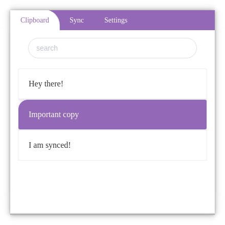
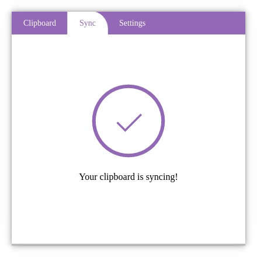

# Clipr
> The clipboard that syncs!  
https://clipr.cloud

* Quickly search all your past copies
* Backup and sync your copies to the cloud
* Easily re-copy your past entries with a click
* Works on Windows, Linux and Mac

## Status

> OS X  

> Windows  

> Linux  

## Downloads

Check github [releases](https://github.com/clipr/clipr/releases) and download the latest release for your platform.
There are both installers and portable archives.

## Building from source

* clone the repo
* run `npm install`
* run `npx webpack`
* run `npx electron-builder build --win|mac|linux`
* You can find the build artifact in the `dist` directory

## Using your own sync provider

If you want to use your own sync provider instead of clipr's built-in provider you can check the
[sync-provider](https://github.com/clipr/sync-provider) project.  
There is more info and installation instructions in the repository's readme.

## Meta

[https://clipr.cloud](https://clipr.cloud) – hello@clipr.cloud

Distributed under the GPL-3.0 license. See ``LICENSE`` for more information.

[https://github.com/clipr](https://github.com/clipr/)

## Contributing

1. Fork it (<https://github.com/clipr/clipr/fork>)
2. Create your feature branch (`git checkout -b feature/fooBar`)
3. Commit your changes (`git commit -am 'Add some fooBar'`)
4. Push to the branch (`git push origin feature/fooBar`)
5. Create a new Pull Request